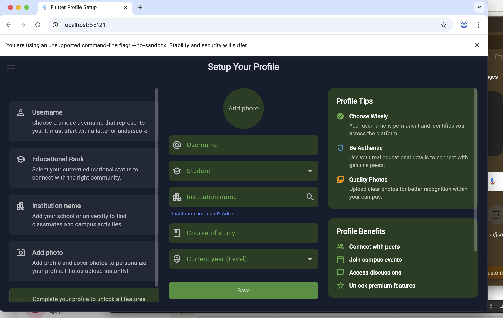
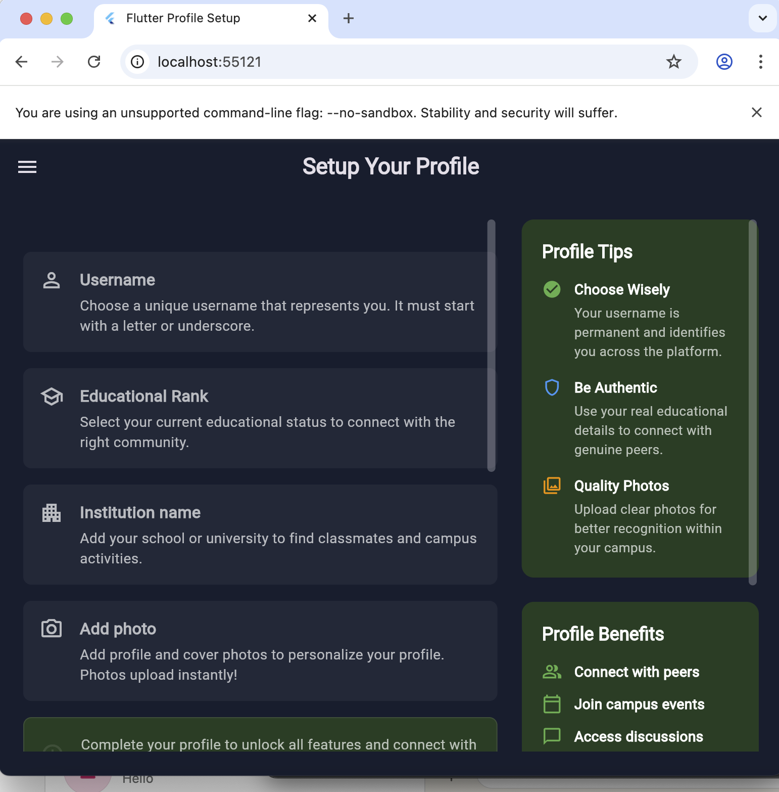
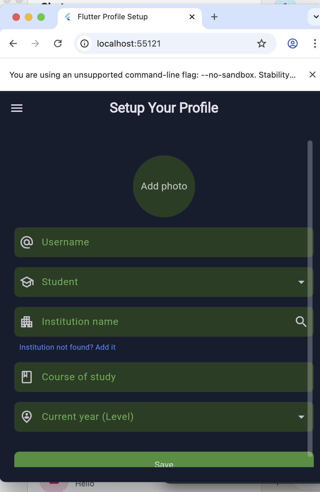

# Campus_connect
🎓 CampusConnect — Responsive Flutter Application

Built with Flutter & Dart

CampusConnect is a cross-platform Flutter application designed for students, with a strong focus on responsiveness, modular UI design, and dark-themed aesthetics.
The app adapts seamlessly across screen sizes, delivering an optimized experience on mobile, desktop, and web.

This project demonstrates practical implementation of adaptive layouts, reusable components, and clean Flutter architecture.

---

📚 Overview

Adaptive UI system with desktop-first logic

Dark-themed interface using a custom color system

Multi-step student profile onboarding

Single codebase supporting all major platforms

---

Screenshots:

Destop:

 
 
 
Tablet:

 
 
 
Mobile:

 
 

---

🌟 Core Capabilities

Responsive Layout System

Desktop and web screens use a three-column structure (Guide | Main Content | Tips)

Layout automatically restructures for smaller devices

Centralized responsiveness logic for maintainability

Key file: responsive_layout.dart

---

Dark Theme Experience

Custom-built dark UI for reduced eye strain

Consistent colors across screens and widgets

Centralized theme control using constants

---

Profile Onboarding Flow

Step-by-step setup for new users

Collects username, academic level, institution, and profile image

Designed for clarity and ease of use

---

Multi-Platform Support

Runs on:

Android

iOS

Web

Windows

Linux

macOS

All platforms are supported from a single Flutter codebase.

---

Modular UI Design

Reusable widgets for inputs, cards, and layout elements

Cleaner codebase and easier long-term maintenance

Faster iteration during development

---

🛠️ Technology Used

Framework: Flutter

Language: Dart

---

🗂️ Codebase Layout

The project structure emphasizes readability and responsiveness:

lib/
└── main.dart                 # App

---

🚀 Running the App Locally

Requirements

Before starting, ensure you have:

Flutter SDK (version 3.19+ recommended)

Dart SDK

A compatible IDE (VS Code or Android Studio)

---

Setup Steps

Clone the repository:

git clone [https://github.com/Gods-Peare/Campus_connect/edit/main]

Install dependencies:

flutter pub get

Launch the app:

flutter run

---

Platform Targets

Run on a specific platform using:

flutter run -d chrome     # Web
flutter run -d windows    # Windows
flutter run -d linux      # Linux
flutter run -d android    # Android
flutter run -d ios        # iOS

---

🎨 Theme & Color System

The application uses a custom dark color palette, defined in constants/colors.dart, to maintain visual consistency.

Color Role	Hex

Primary Blue	#02569B
Accent Teal	#00BCD4
Background Dark	#1E1E1E
Surface/Card	#2C2C2C
Text (Light)	#FFFFFF

These colors power the app’s branding, surfaces, and interaction states.
